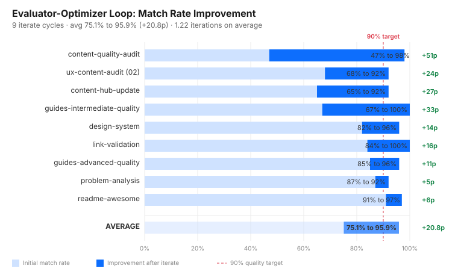
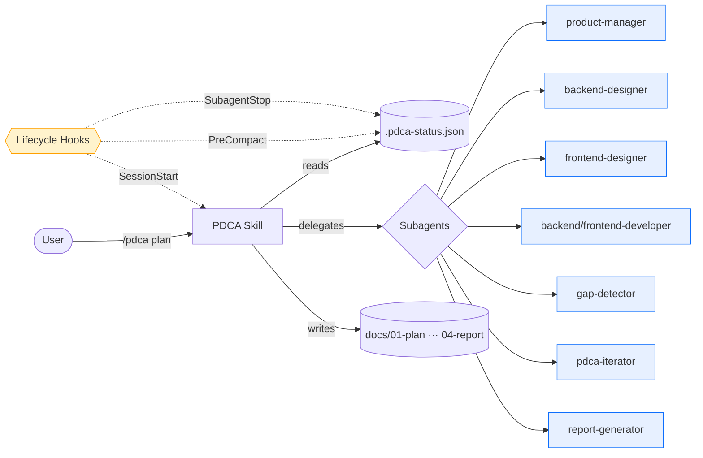
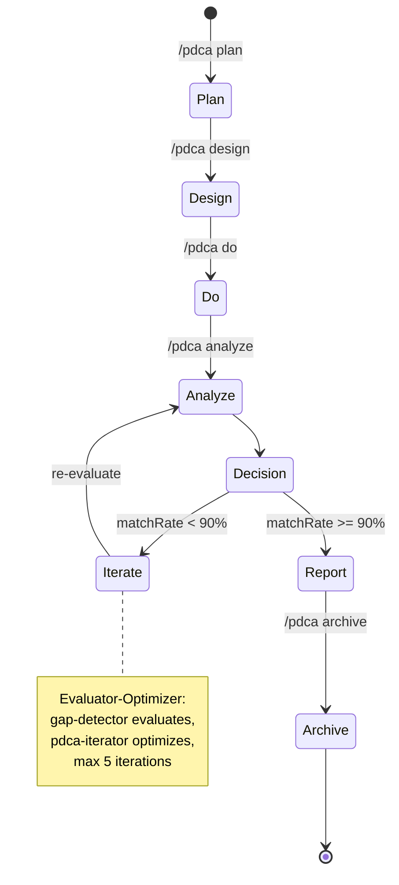

# Claude Code PDCA Automation System

> **PDCA 품질관리 사이클 × LLM 워크플로우** — 설계·구현·검증·개선·보고를 슬래시 커맨드 한 줄로 자동화한 Claude Code 확장 시스템.

    

---

## TL;DR

LLM이 만든 코드는 **빠르지만 검증이 약하다**. 본 시스템은 PDCA(Plan-Do-Check-Act) 품질관리 방법론을 Claude Code 위에 얹어,
설계 문서와 구현 코드 간 **Match Rate를 정량 측정**하고 90% 미만이면 **자동 개선 루프**(Evaluator-Optimizer)가 돌아가
사람의 리뷰 부담 없이 일관성을 유지한다.

```
/pdca plan auth   →   /pdca design auth   →   /pdca do auth
                                                    ↓
              report  ←  iterate (auto-fix)  ←  analyze (gap)
```

---

## Production Metrics

> 실제 운영 프로젝트(`cc-board`) 적용 결과. 측정 근거: `docs/_metrics/quantitative-report.md`.

| 지표 | 값 | 비고 |
|------|---:|------|
| 적용 기간 | **6일** | 2026-02-27 ~ 03-04, 병렬 PDCA 사이클 |
| 완료 기능 | **78개** | 77 archived + 1 active |
| 자동 생성 문서 | **310편** | Plan 74 / Design 75 / Analysis 75 / Iteration 9 / Report 77 |
| 총 라인 / 단어 | **81,052 / 437,863** | wc 집계 |
| 평균 최종 Match Rate | **94.0%** (median 95%) | 77건 |
| 90% 이상 통과율 | **96.1%** (74/77) | |
| Iterate 평균 향상폭 | **+20.8p** (75.1% → 95.9%) | 9건 평균 |
| Iterate 평균 반복 횟수 | **1.22회** (max 2) | |
| 문서화 시간 절감 | **약 73%** | 수동 환산 461.8h → 자동 wall-clock 125.6h |
| 시스템 규모 | **15 Subagents · 6 Hooks (504 LOC) · 18 Skill 파일** | |

### Iterate 자동 개선 효과



> 9개 사이클 모두 **+5p ~ +51p** 향상, 평균 **1.22회 반복**으로 90% 품질 목표 달성.

---

## Why — 왜 만들었는가

LLM 기반 코드 생성을 실무에 6개월간 사용하며 마주한 3가지 문제:

1. **설계와 구현의 표류** — Plan 단계 의도가 Do 단계에서 누락되거나 변형되어도 감지 불가
2. **품질 측정의 부재** — "잘 만들어졌는지" 판단을 매번 사람이 수동 리뷰
3. **반복 작업의 비효율** — 기능마다 Plan/Design/Report를 손으로 작성, 양식·누락 일관성 없음

해결: **소프트웨어 공학의 검증된 PDCA 사이클**을 LLM 워크플로우의 강제 흐름으로 박는다. Match Rate라는 정량 지표를 도입해 사람이 매번 보지 않아도 품질 회귀를 자동 차단한다.

---

## Architecture



### PDCA Loop 상세



---

## Components

### 1. PDCA Skill (`/pdca`)

| 액션 | 설명 | 산출물 |
|------|------|--------|
| `plan` | 요구사항·범위 정의 | `docs/01-plan/features/{f}.plan.md` |
| `design` | API/데이터 모델/UI 설계 | `docs/02-design/features/{f}.design.md` |
| `do` | 구현 오케스트레이션 | (Subagent에 위임) |
| `analyze` | 설계↔구현 Gap 분석 | `docs/03-analysis/{f}.analysis.md` |
| `iterate` | 자동 개선 루프 | `*.iteration-{n}.md` |
| `report` | 완료 보고서 생성 | `docs/04-report/features/{f}.report.md` |
| `archive` | 완료 기능 정리 | `docs/archive/YYYY-MM/{f}/` |
| `cleanup` | status·history 정리 | |
| `commit` | git 커밋 보조 | |
| `status` / `next` | 진행 시각화·다음 액션 안내 | |

### 2. Subagents (15)

역할 분리로 단일 컨텍스트의 한계를 극복.

| 카테고리 | Agent | 역할 |
|---------|-------|------|
| **Plan** | `product-manager` | 요구사항·우선순위·사용자 스토리 |
| **Design** | `system-architect` | 아키텍처·기술 스택·인프라 |
| | `backend-designer` / `frontend-designer` | API 명세·UI 흐름 |
| **Do** | `backend-developer` / `frontend-developer` | 설계 기반 구현 |
| **Check** | `code-analyzer` | 코드 품질·보안·성능 |
| | `gap-detector` | **설계↔구현 Match Rate 산정** |
| **Act** | `pdca-iterator` | **Evaluator-Optimizer 자동 개선 루프** |
| **Report** | `report-generator` | 사이클 완료 보고서 |
| **Specialty** | `design-validator`, `content-specialist`, `technical-writer`, `a11y-auditor`, `skill-maker` | 도메인 특화 |

### 3. Lifecycle Hooks (504 LOC)

| Hook | 트리거 | 역할 |
|------|-------|------|
| `session-start.js` | 세션 시작 | 활성 PDCA 상태 출력, 캐시 워밍 |
| `user-prompt.js` | 사용자 입력 시 | 컨텍스트 주입 |
| `subagent-start.js` / `subagent-stop.js` | Subagent 라이프사이클 | 호출 추적·status 갱신 |
| `pre-compact.js` | 컨텍스트 압축 직전 | **상태 영속화 (캐시 비용 최적화 핵심)** |
| `stop.js` | 세션 종료 | 진행 사항 저장 |

---

## Quick Start

```bash
# 1. .claude/ 를 프로젝트 루트에 복사
cp -r path/to/this/.claude .

# 2. Node.js 18+ 확인 (Hook 실행용)
node --version

# 3. Claude Code 세션 시작
claude

# 4. 첫 PDCA 사이클
/pdca plan my-feature
/pdca design my-feature
/pdca do my-feature
/pdca analyze my-feature   # ← Match Rate 산정
/pdca iterate my-feature   # ← <90%일 때만, 자동 개선
/pdca report my-feature
/pdca archive my-feature
```

상태는 항상 `/pdca status`로 시각화 가능:

```
PDCA Status
─────────────────────────────────
Feature: my-feature
Phase: check (4/6)
Match Rate: 87%
Iteration: 0/5
─────────────────────────────────
[Plan] ✓ > [Design] ✓ > [Do] ✓ > [Check] ● > [Act] ○ > [Report] ○
```

---

## Design Decisions

### 왜 Subagent를 분리했나
단일 세션 컨텍스트로는 **설계·구현·검증을 동시에 보유하기 어렵다.** 각 역할에 컨텍스트를 격리하면 토큰 효율과 정확도가 모두 향상된다. 특히 `gap-detector`는 평가 시 구현 코드만 보고 평가해야 편향이 없다.

### 왜 Match Rate를 90%로 잡았나
- **100%는 비현실적**: 자연어 설계 ↔ 코드의 1:1 매핑은 불가능
- **80%는 약함**: 누락된 20%가 핵심 기능일 수 있음
- 9건의 iterate 데이터에서 **평균 1.22회로 90% 도달** → 비용·품질 균형점

### 왜 Hook을 PreCompact에 두었나
Anthropic 프롬프트 캐시는 5분 TTL. 컨텍스트 압축 시 **status를 디스크로 빼두지 않으면 다음 턴이 cold cache로 시작**해 비용·지연이 폭증한다. PreCompact Hook이 핵심 상태만 디스크로 옮긴다.

---

## Honest Limitations

투명성은 신뢰의 기반이다. 솔직히 인정하는 한계:

1. **데이터 수집 6일치** — 본 메트릭은 단일 프로젝트(`cc-board`) 6일 적용 결과. 장기 운영 데이터는 누적 중.
2. **수동 환산률은 가정값** — Plan/Design 200라인/h, 그 외 150라인/h. 실제 라이팅 속도와 차이 가능.
3. **Match Rate는 LLM 자가 평가** — `gap-detector`도 LLM. 인간 리뷰어 대비 편향 가능성. 절대 기준이 아닌 상대 추세 지표로 활용.
4. **status.json history 정리 이력** — phase별 timestamp는 6건 샘플만 측정 가능, 나머지는 git commit 보조.
5. **모델 비용** — 매 사이클당 Subagent 다수 호출로 토큰 사용량 적지 않음. 비용 vs 절감 시간 트레이드오프 고려 필요.

---

## Roadmap

- [ ] Match Rate 산정에 **2nd LLM cross-validation** 추가
- [ ] 다중 프로젝트 **누적 메트릭 대시보드**
- [ ] **CI 통합** — PR 시 `/pdca analyze` 자동 실행
- [ ] **Match Rate < N% 시 PR 자동 차단** GitHub Action
- [ ] 한국어/영어 템플릿 분기

---

## License & Author

MIT License · Built by [@ohg0219](https://github.com/ohg0219)

> 6개월간 Claude Code를 실무에 사용하며 축적된 패턴을 시스템화한 결과물.
> AI 시대의 개발자는 **AI를 쓰는 사람**이 아니라 **AI 워크플로우를 설계하는 사람**이라는 가설의 실증.
